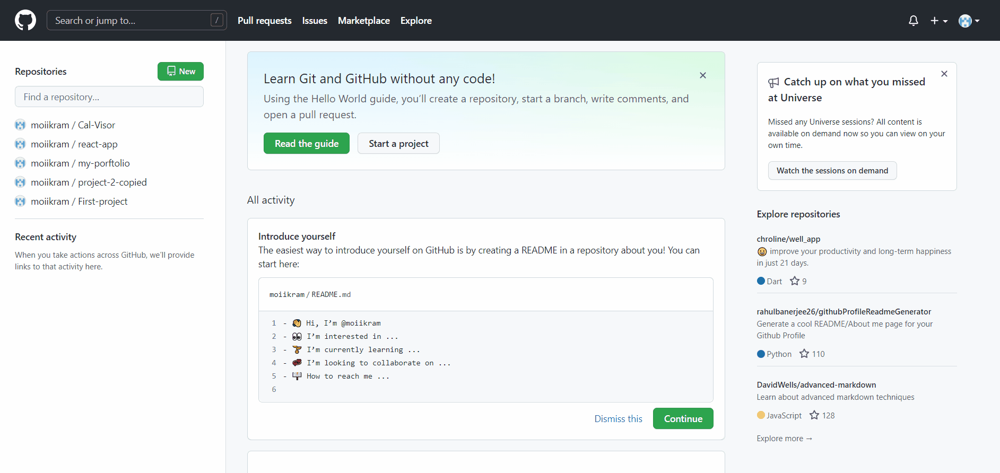

# Hosting a Resume Online

In this assignment, I am going to show you how you can succesfully host a resume, written in markdown language, on Github Pages, a provider of Internet hosting for software development and version control using Git. We will follow the key principals and tools mentioned in Andrew Etter’s book _Modern Technical Writing_ : a lightweight markup language (_Markdown_), a static site generator (_Jekyll_), distributed version control sysytem (_Git_) and hosting on a website (_GitHub Pages_)

## Prerequisites

Following the tools mentioned by Etter, you will need

- Markdown
- A Markdown editor (e.g., VScode)
- A static site generator(e.g., Jekyll)
- GitHub Pages
- A resume formatted in Markdown.

## Instructions

If you look at the above picture, you can see a resume formatted in markdown which is one of the tools mentioned in Andrew Etter’s book _Modern Technical Writing_.

To learn more about Markdown, check out "More Resources" at the bottom of this file.

- lightweight markup languages (like AsciiDoc and Markdown),
- static site generators (such as Sphinx),
- distributed version control systems (like Git or Bitbucket), - constantly iterating/updating doc content on your website based on analytics,

For this assignment, I am using VSCode editor to create the resume formatted in markdown. You can download VScode from [here](https://code.visualstudio.com/download).

- To get a live markdown preview click

```keyboard shortcut
Ctrl+K V
```

To host the resume online, you will need a [GitHub](https://github.com/signup?source=login) account where we will keep the codes.

- Head over to [GitHub](https://github.com/signup?source=login) to create an account.

1. Once you have an active account, you need a create a repository with the same name as your GitHub user name.

2. 

**Select a Jekyll theme on Github to format the document.**

- On your GitHub Account, click "Settings".
- Click on "Pages" menu.
- Click on "choose a theme".
- Select a theme and click on the button "select theme" to set up a jekyll theme for the site.
- To view the new website you created, click on the link on the "Pages" page.

  

## Deployment

Add additional notes to deploy this on a live system

## Authors and Acknowledgments:

- Ikram Khan Shipon
- Joshua Moreira
- Anton Sikorsky
- Ryan Campbell
- Kevin Kim

## Contributing

Pull requests are welcome. For major changes, please open an issue first to discuss what you would like to change.

## License

## FAQs

Why is Markdown better than a word processor?

> Markdown is simple, effective tool for writing and formatting documents meant to reside on the web. It has limited functionalty which makes it easy to learn and it only requires a text editor to craete and format the document. It can be converted to many other formats unlike word processor documents which may lose some

Why is my resume not showing up?

> Make sure the keep you resume file name "index.md" as this is the main file that is displayed on the github page. Additionally, keep the file in the root directory.

## More Resources

- [Markdown Markup Language – Quick Tutorial](https://helloacm.com/markdown-markup-language-quick-tutorial/)

- [Etter, Andrew. Modern Technical Writing. Kindle edition, Self-published, 2016.](https://www.amazon.ca/Modern-Technical-Writing-Introduction-Documentation-ebook/dp/B01A2QL9SS/ref=sr_1_1?crid=U9576L9YVQXR&dchild=1&keywords=etter+technical+writing&qid=1635643082&sprefix=etter+technical+writin%2Caps%2C205&sr=8-1)

- [Mike Dane's Jekyll Static Site Generator Tutorial](https://www.youtube.com/playlist?list=PLLAZ4kZ9dFpOPV5C5Ay0pHaa0RJFhcmcB)
