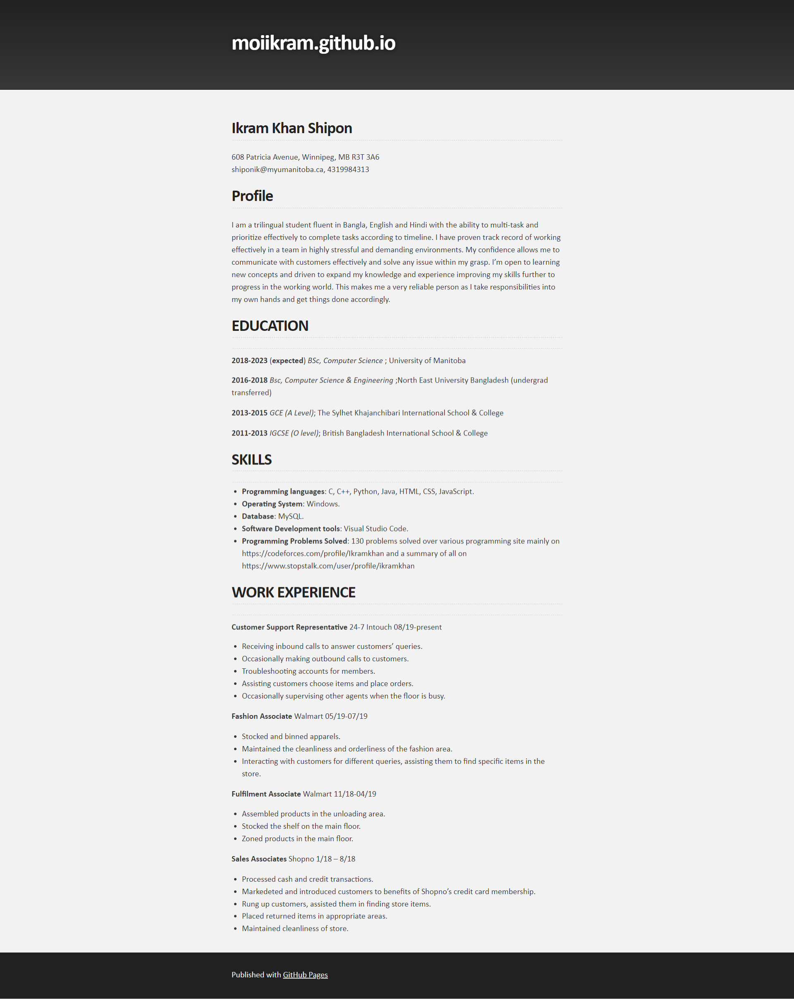

# Hosting a Resume Online

In this tutorial I am going to show you how you can succesfully host a resume, written in markdown language, on Github, a popular code repository.

One Paragraph of the project description

## Prerequisites

To get started on on your way you will need

- Markdown
- A Markdown editor
- A static site generator like Jekyll
- GitHub Pages or Codeberg Pages
- A resume formatted in Markdown.

## Instructions

If you look at the above picture, you can see a resume formatted in markdown which is one of the tools mentioned in Andrew Etter’s book _Modern Technical Writing_.

- lightweight markup languages (like AsciiDoc and Markdown),
- static site generators (such as Sphinx),
- distributed version control systems (like Git or Bitbucket), - constantly iterating/updating doc content on your website based on analytics,

For this assignment, I am using VSCode editor to create the resume formatted in markdown.

To host the resume online, you will need a [GitHub](https://github.com/signup?source=login) account where we will keep the codes.

## Authors and Acknowledgments:

Ikram Khan Shipon

credit template authors and group membe

## FAQs (with at least two FAQ

## More Resources

- Here's link to learn about Markdown  
  https://helloacm.com/markdown-markup-language-quick-tutorial/

- Here's a link to buy the Ettor's book  
  https://www.amazon.ca/Modern-Technical-Writing-Introduction-Documentation-ebook/dp/B01A2QL9SS/ref=sr_1_1?crid=U9576L9YVQXR&dchild=1&keywords=etter+technical+writing&qid=1635643082&sprefix=etter+technical+writin%2Caps%2C205&sr=8-1
