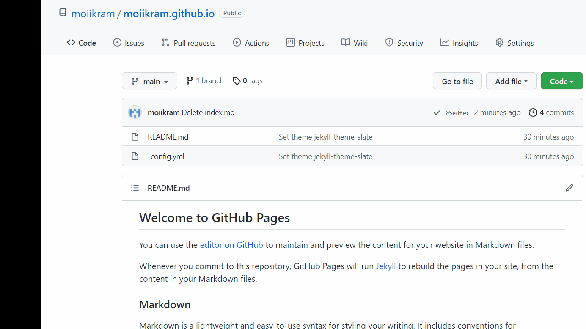

# Hosting a Resume on GitHub Pages

## Purpose

The purpose of this README is to describe the practical steps of how to host and format a resume, and to relate those steps to the general principles of current Technical Writing, as explained in Andrew Etter’s book _Modern Technical Writing_

## Prerequisites

- **A resume formatted in Markdown** - To put it simply, Markdown is a simple and effective lightweight markup language used to create and format documents for the web. To learn more about it and how to use Markdown, check the link under the "More Resources" section at the bottom of this document.

- **A Markdown editor** - You may use any markdown editor of your choice to create and format the resume. I am using _VScode_ for this assignment and you can download it [here](https://code.visualstudio.com/download).

- **A GitHub Account** - To host the resume online with GitHub Pages, you will have to create a GitHub account. Please click [here](https://github.com/join) and follow the instructions to create your account.

## Instructions

### Create a resume file with .md or .markdown format.

> 1. Inside VScode click on "**File**".
> 2. Click "**New File**".
> 3. Type your markdown text for the resume.
> 4. Save the file.
> 5. Type the name of a resume as _`index.md`_ and
> 6. Click "**Save**".
> 7. To enable the live markdown preview press `Ctrl+K V`.

> In Etter's book, he mentions using a markdown file as well as keeping the files on a website instead of PDFs. This makes it easier to contribute from other people and up to date.

### Create a new repository on GitHub.

> 1. In the upper left corner of the home page, click on the green button labeled **New**.
> 2. Type a name for your repository in the format **username.github.io** and replace the username with your actual GitHub username.
> 3. Select **Initialize this repository with a README**.
> 4. Click **Create repository**.

> Etter's speaks about using Version Control System to store the codes to allow easier contribution which is demonstrated by the above steps.

### Format the website using a Jekyll theme on GitHub.

> 1.  On your GitHub repository, click on "Settings".
> 2.  Click on the "Pages" menu.
> 3.  Click on "Choose a theme".
> 4.  Select a theme.
> 5.  Click on "select theme" to set up a Jekyll theme for the site.

> Etter also mentions using a static site generator to format the website layout which can be refelcted by the above steps

### Upload the markdown formatted resume on GitHub.

> 1.  On your GitHub repository, click on "Add File" at the top of the page.
> 2.  From the drop-down menu, select "Upload files".
> 3.  Click on "choose your files".
> 4.  Select the markdown formatted resume.
> 5.  Click "Open".
> 6.  Type a comment for this new "commit"
> 7.  Click "Commit changes"

> These steps above reinforce Etter's principle of storing documentation in the same folder as the project.

Finally, View the uploaded resume website.

> 1.  From your repository, click on "Settings".
> 2.  Click on "Pages".
> 3.  Click the link that would appear towards the top. The link format will be https://username.github.io/ where username will be your GitHub username

## Authors and Acknowledgments:

- Ikram Khan - author of the resume and README.
- Peer Editors: Joshua Moreira, Anton Sikorsky, Ryan Campbell, and Kevin Kim.
- [pandoc_resume](http://mszep.github.io/pandoc_resume/) - Resume format adapted from here.
- [Jekyll Theme](https://github.com/pages-themes/slate)- This theme was used to format the resume.

## Contributing

If you want to make any changes and update my files, pull requests are welcome.

## FAQs

Why is Markdown better than a word processor?

> Markdown is a simple, effective tool for writing and formatting documents meant to reside on the web. It has limited functionality which makes it easy to learn and it only requires a text editor to create and format the document. It can be converted to many other formats unlike word processor documents which may lose some

Why is my resume not showing up?

> Make sure to keep your resume file name "index.md" as this is the main file that is displayed on the GitHub page. Additionally, keep the file in the root directory.

## More Resources

- [Markdown Markup Language – Quick Tutorial](https://helloacm.com/markdown-markup-language-quick-tutorial/)

- [Etter, Andrew. Modern Technical Writing. Kindle edition, Self-published, 2016.](https://www.amazon.ca/Modern-Technical-Writing-Introduction-Documentation-ebook/dp/B01A2QL9SS/ref=sr_1_1?crid=U9576L9YVQXR&dchild=1&keywords=etter+technical+writing&qid=1635643082&sprefix=etter+technical+writin%2Caps%2C205&sr=8-1)

- [Mike Dane's Jekyll Static Site Generator Tutorial](https://www.youtube.com/playlist?list=PLLAZ4kZ9dFpOPV5C5Ay0pHaa0RJFhcmcB)

- [GitHub Guide](https://guides.github.com/activities/hello-world/)
